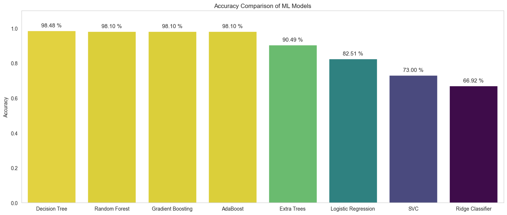
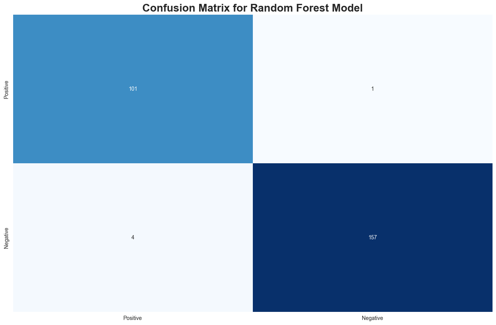

# Heart Attack ML Model
<div align="center">

[](https://python.org)
[](https://python.org)
[](https://numpy.org)
[](https://scikit-learn.org)
[](https://matplotlib.org)
[](https://seaborn.pydata.org)


</div>

## 📑 Description
This project involves the analysis and prediction of heart attack risks using a medical dataset. The workflow includes data loading, cleaning, Exploratory Data Analysis (EDA), and preparation for Machine Learning modeling to classify patients as positive or negative for heart attack risk.

## 📂 Project Structure
- **`Heart_Attack_ML.ipynb`**: The main Jupyter Notebook containing the code for data processing, visualization, and modeling.
- **`Heart Attack.csv`**: The dataset used for training and analysis.

## 📊 Dataset Description
The [**Dataset**](https://www.kaggle.com/datasets/bharath011/heart-disease-classification-dataset/data)
 contains medical records with the following attributes:

| Column | Description |
| :--- | :--- |
| **age** | Age of the patient |
| **gender** | Gender of the patient (0/1) |
| **impluse** | Heart rate / Impulse |
| **pressurehight** | Systolic Blood Pressure (High) |
| **pressurelow** | Diastolic Blood Pressure (Low) |
| **glucose** | Blood Glucose Level |
| **kcm** | CK-MB (Creatine Kinase-MB) levels |
| **troponin** | Troponin levels (key marker for heart injury) |
| **class** | Target Variable (`positive` = Risk, `negative` = No Risk) |

## 📈 Analysis & Insights
The notebook performs the following steps:
1.  **Data Loading**: Reading the CSV file into a Pandas DataFrame.
2.  **Data Cleaning**: Checking for null values and duplicates.
3.  **EDA (Exploratory Data Analysis)**:
    * Statistical summary of features (`describe()`).
    * Distribution of the target class (`positive` vs `negative`).
    * Visualizations including Pie charts and Count plots to understand class balance.


## ⚙️ Data Preprocessing
To ensure the dataset was ready for machine learning, the following preprocessing steps were performed:

1.  **Data Cleaning**:
    * **Missing Values**: Checked the dataset for null values (`isnull().sum()`) to ensure data completeness.
    * **Duplicates**: Verified there were no duplicate records (`duplicated().sum()`) to maintain data integrity.

2.  **Feature Engineering & Adjustments**:
    * **Column Renaming**: Renamed columns for better readability and to correct typos (e.g., standardizing feature names).
    * **Outlier Removal**: Analyzed and removed outliers from key numerical features to prevent skewing the model and improve prediction accuracy.

3.  **Data Transformation**:
    * **Categorical Encoding**: The target variable `class` (`positive`/`negative`) was encoded into numerical format for the model.
    * **Feature Scaling**: Applied `StandardScaler` to normalize the range of independent variables, ensuring that features with large values (like Glucose) don't dominate the model.

4.  **Data Splitting**:
    * The dataset was split into training and testing sets using `train_test_split` to properly evaluate the model's performance on unseen data.

## ✅ Models Accuracy


## 🟢 Random Forest Confusion Matrix


## 🚀 How to Run
1.  Ensure you have Python installed along with the required libraries:
    ```bash
    pip install pandas numpy seaborn matplotlib scikit-learn
    ```
2.  Place `Heart Attack.csv` in the same directory as the notebook.
3.  Open `Heart_Attack_ML.ipynb` in Jupyter Notebook or VS Code.
4.  Run the cells sequentially to reproduce the analysis.

